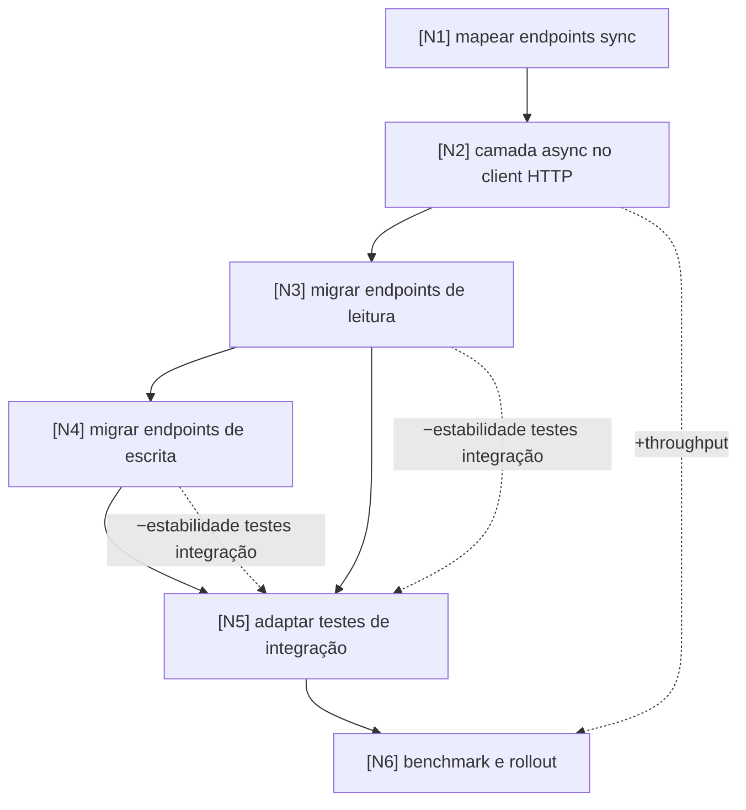

# Task Graph: Migrar endpoints de sync para async

> Exemplo do perfil geral da skill `graph-lab`, preenchido. Tarefa de exemplo: uma
> API FastAPI com handlers síncronos que precisam virar async sem quebrar a suíte
> de integração. Nenhum nó treina modelo, então as seções só saúde/ML do template
> saem.

Perfil: geral

## Objetivo

Migrar todos os endpoints da API de handlers síncronos para async, elevando o
throughput sob carga. Métricas em tensão: **throughput** (queremos subir) vs.
**estabilidade dos testes de integração** (a migração introduz race conditions
em fixtures que assumem execução serial).

## Grafo

## Nós

| id | descrição | métrica de sucesso | entregável | status |
|----|-----------|--------------------|------------|--------|
| N1 | Inventariar todos os handlers sync e seus consumidores | lista cobre 100% das rotas registradas no router | `docs/sync-inventory.md` | pending |
| N2 | Trocar `requests` por `httpx.AsyncClient` na camada de client HTTP | zero chamadas bloqueantes restantes (`grep -r "requests\."` vazio em `app/clients/`) | `app/clients/http.py` async | pending |
| N3 | Migrar endpoints de leitura (GET) para `async def` | 100% dos GET async, suíte de unidade verde | handlers async em `app/routes/read.py` | pending |
| N4 | Migrar endpoints de escrita (POST/PUT/DELETE) para `async def` | 100% dos handlers de escrita async, suíte de unidade verde | handlers async em `app/routes/write.py` | pending |
| N5 | Adaptar testes de integração para o event loop (fixtures async, isolamento de DB por teste) | suíte de integração verde em 5 execuções consecutivas (sem flakes) | `tests/integration/` atualizado + `conftest.py` com fixtures async | pending |
| N6 | Benchmark comparativo e rollout gradual | p95 de latência ≤ baseline e throughput ≥ +30% sob 200 conexões concorrentes | relatório `docs/benchmark-async.md` + feature flag de rollout | pending |

## Efeitos colaterais auditados

| aresta | risco | mitigação / aceite |
|--------|-------|--------------------|
| `N3 -.->|−estabilidade testes integração| N5` | fixtures que assumem execução serial passam a sofrer race conditions com handlers async de leitura | **Mitigação**: N5 introduz isolamento de banco por teste (transação com rollback) e fixtures `pytest-asyncio` com escopo de função antes de rodar a suíte completa |
| `N4 -.->|−estabilidade testes integração| N5` | escritas concorrentes no DB de teste geram deadlocks e resultados não determinísticos | **Mitigação**: mesma estratégia de isolamento de N5 + escritas de teste serializadas via lock de fixture; critério de N5 exige 5 execuções verdes consecutivas exatamente para capturar flakes |
| `N2 -.->|+throughput| N6` | efeito positivo: client async destrava o ganho medido em N6 | nada a mitigar; registrado para rastreabilidade do ganho |

## Ordem de execução

<!-- saída de scripts/validate_graph.py, sem ciclos -->
1. N1
2. N2
3. N3
4. N4
5. N5
6. N6

## Log de replanejamento

- (vazio, nenhuma dependência nova descoberta até aqui)
