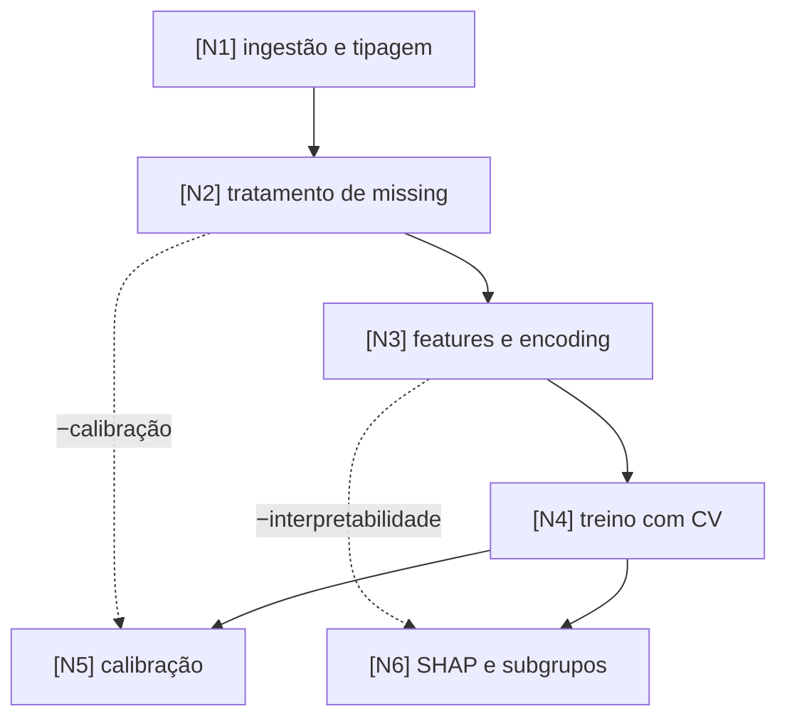

# Task Graph: {{título-curto-do-experimento}}

> Gerado pela skill `graph-lab`. Este arquivo é a fonte da verdade da rodada:
> todo update de status acontece aqui, nunca só na conversa.

## Identificação

| Campo | Valor |
|---|---|
| Desfecho | {{o que se prediz, com a definição operacional exata}} |
| Tipo | {{classificação, regressão, sobrevivência, séries temporais, visão, NLP}} |
| Base | {{fonte do dado e recorte, sem caminho de máquina pessoal}} |
| Unidade de análise | {{paciente, internação, exame, município, mês}} |
| Momento da predição | {{quando o modelo roda na prática, o que já se sabe nesse instante}} |
| Reporting guideline | {{TRIPOD+AI, STROBE, STARD, PRISMA}} |

## Objetivo

{{1 a 3 frases: o que o experimento entrega e quais métricas estão em tensão}}

## Grafo

## Nós

| id | descrição | métrica de sucesso | entregável | status |
|----|-----------|--------------------|------------|--------|
| N1 | {{...}} | {{o número que decide que está pronto, com a incerteza}} | {{arquivo}} | pending |
| N2 | {{...}} | {{...}} | {{...}} | pending |

<!-- status: pending -> in_progress -> done -->
<!-- resultado negativo fecha o nó como done, com o achado registrado -->

## Efeitos colaterais auditados

| aresta | risco | mitigação / aceite |
|--------|-------|--------------------|
| N2 -.-> N5 | {{imputar altera a distribuição e desloca a probabilidade prevista}} | {{recalibrar e reportar Brier antes e depois}} |
| N3 -.-> N6 | {{...}} | {{ação concreta OU "aceito pelo usuário em {{data}}"}} |

## Checklist anti-leakage

<!-- obrigatório antes de qualquer nó de modelagem -->

- [ ] desfecho e proxies do desfecho fora das preditoras
- [ ] nenhuma variável registrada depois do momento da predição
- [ ] imputação, encoding, escalonamento e seleção aprendidos dentro do fold de treino
- [ ] divisão respeita a unidade de dependência (paciente, hospital, período)
- [ ] em série temporal, validação temporal e nenhuma janela futura no passado

## Regra de dados

- [ ] dado bruto fora do repositório, inclusive do privado
- [ ] `.gitignore` cobre os diretórios de dado
- [ ] repositório público, se existir, só com dado sintético

## Ordem de execução

<!-- saída do AUDIT: ordem topológica das arestas depends_on -->

1. {{N1}}
2. {{N2}}

## Log de replanejamento

<!-- toda dependência ou efeito descoberto durante EXECUTE entra aqui, com data -->

- {{(vazio)}}

## Página do grafo

- Caminho: `graphs/task-graph.html`
- URL publicada: {{preencher na primeira publicação e reutilizar sempre}}
